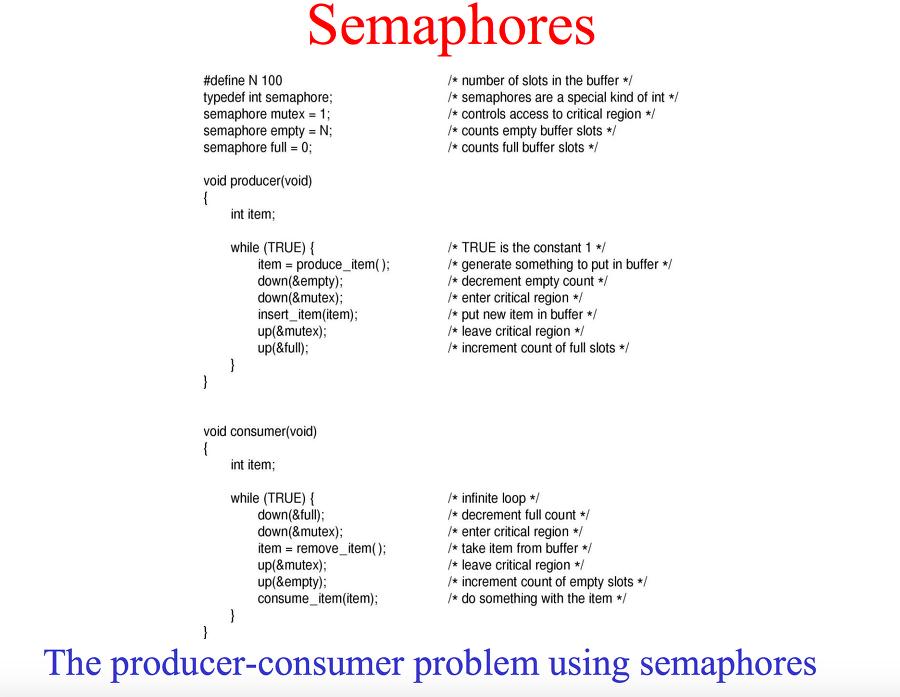
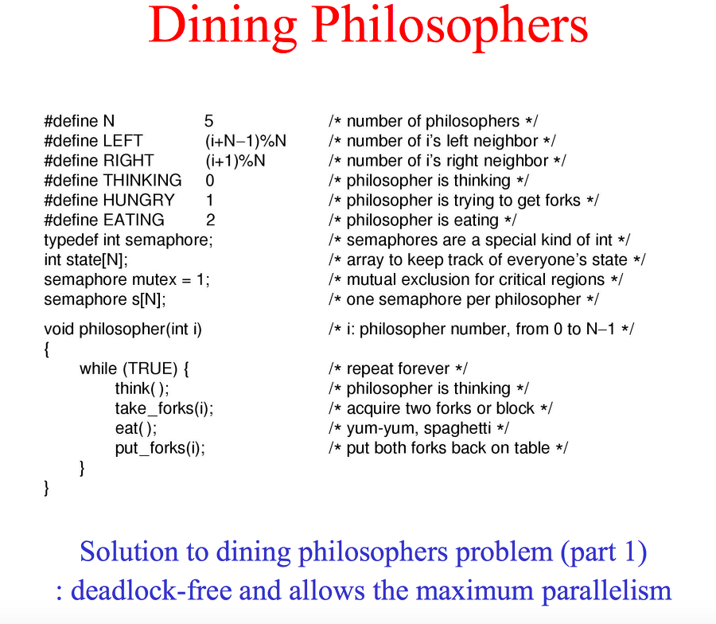
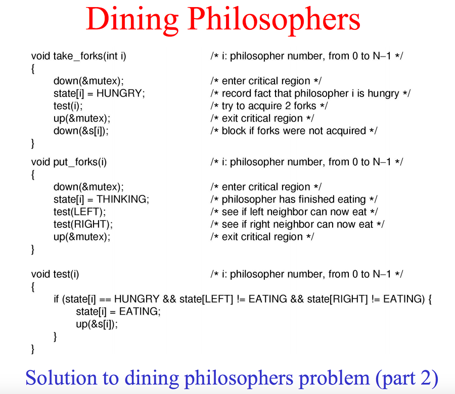

## Operating System
---

> 사용자가 컴퓨터를 손쉽게 이용할 수 있도록 해 주는 프로그램으로서 하드웨어와 사용자의 가교 역할을 한다


### 기본 용어 정의

---


일괄 처리 : 다수의 프로그램을 읽어 저장해 놓되, 한 번에 한 개씩의 프로그램을 실행시켜 주는 방식

시스템 호출(System Call) : 유저 모드로 실행 중 커널 모드에서 해야 할 일이 생기면 프로그램은 시스템 호출을 하게 되고, 이후 그 일을 해 줄 운영체제 프로그램이 커널 모드에서 실행된 다음 다시 사용자 프로그램으로 복귀

부팅 : 커널이라고 불리는 운영체제의 일부가 메모리에 올라와 실행되어 장치들을 준비시키고 각종 레지스터 값을 초기화 한 뒤에 사용자의 입력을 받을 준비를 마친 상태

레지스터 : 메모리보다 빠른 기억 장치로, 주로 데이터나 명령어의 메모리 주소를 저장 및 계산하는 데 사용

인터럽트(Interrupt) : 각 자원들이 능동적으로 자신의 상태 변화를 CPU에게 알리는 방식 <-> 폴링(Polling)

폴링(Polling) : CPU가 주기적으로 각 자원들의 상태를 확인하는 방식

문맥교환(Context Switching) : 현재까지 하던 일에서 잠시 다른 일을 해야 할 때, 현재까지의 상태(PCB)를 보관해두었다가 다른 일을 한 뒤 다시 원래의 일을 함

프로세스 : 수행 중인 프로그램

프로세스 제어 블록(Process Control Block, PCB) : 프로세스가 생성되고 사라질 때 까지 필요한 정보를 담고 있으며 테이블 모양의 자료 구조를 띰

Swap : 프로세스가 메모리 공간을 뺏기고 디스크로 나가는 것(Swap out)과, 나중에 다시 메모리로 들어오는 것(Swap in)을 통칭해 Swap이라 함

스레드(Thread) : 프로세스의 실행 단위

다중 스레딩(Multi-threading) : 하나의 프로세스를 다수의 스레드로 만들어 실행하는 것

다중 프로그래밍 : 메모리에 여러개의 프로세스를 올려놓는 것

시분할 : CPU의 가동 시간을 적절히 나누는 것

스케쥴링 : 기다리고 있는 여러 프로세스 중 어떤 프로세스에 자원을 사용할 수 있도록 허가할지 결정하는 것

비선점 스케쥴링 : 한 프로세스가 CPU를 할당받았을 때 CPU를 스스로 반납할 때까지 계속 사용하도록 허용하는 방법

선점 스케쥴링 : CPU를 할당받아 실행 중인 프로세스로부터 CPU를 선점하여(빼앗아) 다른 프로세스에 할당하는 방식

병행 : 메모리에 다수의 프로세스가 같이 존재함

병렬 : 다중처리 시스템의 경우 여러 개의 프로세스가 동시에 시작될 때를 의미함. 처리기의 수가 하나 이상이여야 하며 기본적으로 병행성을 전제로 함

경쟁 상태(Race Condition) : 프로세스들이 공유 데이터에 대해 서로 접근을 시도하는 상황

상호 배제(Mutual Exclusion, Mutex) : 한 번에 하나의 프로세스만이 임계 영역에 들어가야 함

임계 영역(Critical Section) : 임계 자원에 대해 접근하고 실행하는 프로그램 내의 코드 부분

임계 자원(Critical Resource) : 두 개 이상의 프로세스가 동시에 사용할 수 없는 자원

라이브락(Livelock) : 두 프로세스의 속도가 교묘히 맞물렸을 때 둘 다 임계영역에 진입하지 못하는 현상

스핀락(Spinlock) : 임계영역의 중복 진입을 막기 위해 while문을 계속 도는데 이것은 CPU를 가동하였으나 유용한 곳에 사용하지 못하고 낭비하는 결과를 초래한다(실제로는 아무일도 하지 않기보단 접근이 가능한지 무한 체크한다)

동기화 : 임계영역에 대한 실행을 한 번에 한 프로세스만 차례대로 함

세마포어 : 세 개의 특수한 명령들만 접근할 수 있게 허용되는 보호된 변수로서, testAndSet이나 exchange 명령어보다 더 높은 수준에서 상호배제 명령을 구현하게 한다

모니터 : 공유 데이터들과 이들에 대한 임계영역들을 관리하는 소프트웨어 구성체

바쁜 대기 : = Spinlock

교착 상태(Deadlock) : 서로 다른 둘 이상의 프로세스가 상대 프로세스가 차지하고 있는 자원을 무한 대기하고 있는 상태

기아 상태 : 프로세스의 우선순위가 낮아서 원하는 자원을 할당 받지 못하는 상태

안전 상태(Safe State) : 시스템에 있는 모든 프로세스가 유한 시간 내에 정상적으로 종료될 수 있는 상태 <-> 불안전 상태(Unsafe State)

RAG(Resource Allocation Graph) : 자원 할당 그래프, 여러 자원을 그래프 자료 구조로 표현

Sink : 요청하는 자원이 없는, 즉 대기 상태가 아닌 활동 가능한 프로세스, Unblocked Process

검사점(Checkpoint) : 프로세스들은 실행의 중간 중간에 그 시점까지의 실행 결과를 보존하고 표시를 해두는데 이를 검사점이라고 함

오버레이(Overlay) : 메모리의 크기가 적재할 프로그램의 크기보다 작거나 같을 때, 프로그램의 일부만 먼저 적재한 뒤 샐행시킨 다음 나머지 부분을 다시 적재하여 실행을 이어가는 방식

내부 단편화 : 프로세스를 수용하고 남는 공간

외부 단편화 : 분할의 크기 자체가 워낙 작아서 프로세스들을 수용하지 못해 남는 공간

홀(Hole) : 외부 단편화로 남은 공간을 가르킴

50% 규칙 : 메모리의 빈 공간이 많음에도 불구하고 대두분이 홀이어서 별로 크지 않은 프로세스의 적재 요구조차 수용할 수 없는 상황이 생길 수 있게 되는 현상 -> 빈 공간 병합 (1. Adjacent Coalescing, 2. Compaction)

페이지(Page) : 모든 프로그램은 작은 조각들로 나눠지게 되는데, 조각들의 크기를 모두 같도록 할 때의 한 조각을 가르킴. 이는 전송 단위로서 블록(Block)이라고도 함 -> Paging

세그먼트(Segment) : 모든 프로그램은 작은 조각들로 나눠지게 되는데, 조각들의 크기를 서로 다르게 할 때의 한 조각을 가르킴. 이는 전송 단위로서 블록(Block)이라고도 함 -> Segmentation System

사상(Mapping) : 실행 중인 프로그램에서 참조하는 주소가 실제 메모리에 있는 주소와 달라서, 메모리상의 주소로 변환하는 것(프로그램에서 참조하는 주소 : 가상 주소, 실제 메모리상의 주소 : 실주소)

페이지 사상 테이블(Map Table) : 가상 주소를 실주소로 변환하기 위해 프로세스당 하나의 페이지 테이블을 만들어두는 것

엔트리(Entry) : 페이지 테이블의 구성 단위, k개의 페이지를 가지는 프로세스의 페이지 테이블은 k개의 엔트리로 구성되고 엔트리 하나의 크기는 보통 4byte

TLB(Translation Lookaside Buffer) : 고속 캐시의 일종으로, 주소로 접근되는 일반 메모리와는 달리 키(Key) 값으로 찾고자하는 워드를 동시에 접근하는 연관 메모리로서 검색이 빠른 반면 비싼 하드웨어. 즉 가상 주소를 실주소로 빠르게 맵핑해줌

스레싱(Thrashing) : 잠시 후 참조될 페이지의 반복적인 교체가 과도한 페이지 부재를 야기하여 결과적으로 시스템의 성능을 현저히 떨어트리는 현상

고정 할당 : 시스템에서 정해놓은 개수를 사용하도록 하고, 개수의 변동이 없도록 운영하는 경우

가변 할당 : 실행 도중 프로세스에 부여된 프레임의 수에 변동이 있도록 하는 경우

Working Set : 프로세스가 특정 시점에서 집중적으로 참조하는 페이지들의 집합

Window Size : Working Set을 설정할 때 t에서 델타t까지 설정하는데, 여기서 델타t를 Window Size라고 함. 순수한 시간의 크기지만 그대로 구현하기 어려워 페이지 개수라던지 변형을 주어 사용함

### 배경 지식

---

프로그램이 CPU에 의해 실행되기 위해서는 반드시 주기억 장치(메모리)에 있어야 한다

프로세스의 상태 변화는 인터럽트에 의해 처리된다

스케쥴링 기준 : 1. 응답 속도, 2. 처리량 등등...지표들은 서로 상충되는 것들도 있기 때문에 특정 목적을 위해 스케쥴링을 하는 편인다

무한 대기와 교착 상태 비교 : 무한 대기는 오랜 시간 후에라도(외부적 조치 없어도) 무한 대기로부터 벗어나 서비스를 받을 수 있지만, 교착 상태는 불가능하다

페이지 부재 사이의 간격이 크다 : 프레임 크기가 충분하거나 과도하다

페이지 부재 사이의 간격이 짧다 : 스레싱이 일어날 수 있다

동기 : 하나의 프로세스가 끝난 후 다른 프로세스 진행

비동기 : 다른 프로세스의 상태를 모른채로(프로세스가 끝나던 안끝나던) 진행

### 병행 프로세스와 동기화

---

> 프로세스들이 공유 데이터에 대해 서로 접근을 시도하는 상황을 경쟁 상태라 하며, 이러한 경쟁관계에 있는 프로세스들로 인해 상호배제, 교착 상태, 기아와 같은 문제가 발생한다

#### 상호 배제(Mutual Exclusion)

한 번에 하나의 프로세스만이 임계영역에 들어가기 위한 알고리즘

* Dekker Algorithm

```Java
While(true) {
  flag[i] = true;     // 프로세스 i가 임계영역 진입을 시도한다.
  while(flag[j]) {    // 프로세스 j가 현재 임계영역에 있는지 확인한다.
    if(turn == j) {     // 프로세스 j가 임계영역을 사용 중이라면
      flag[i] = false;    // 프로세스 i의 진입을 취소하고,  
      while (turn == j);  // turn이 j에서 바뀔 때 까지 기다린다...
      flag[i] = true;     // j의 turn이 아니면, 즉 임계영역에서 j가 나오면 재진입을 시도한다.
    }
  }
}
/*이 부분은 임계영역이다*/
...
turn = j;           // 임계영역의 사용이 끝나면, turn을 넘긴다
flag[i] = false;    // 진입 flag값을 false로 바꾸어 임계영역 사용 완료를 알린다.
...
}
```

* Peterson Algorithm

Peterson Algorithm은 Dekker Algorithm을 간결하게 만든 것으로, 상대방에게 진입기회를 양보한다는 차이가 있다

```Java
while(true) {
  flag[i] = true;            // 프로세스i가 임계영역에 진입을 시도
  turn = j;                  // 다른 프로세스에 진입 기회를 양보
  while(flag[i] && turn == j); // 다른 프로세스가 진입을 시도하면 대기 아니면 진입
/* 이곳은 임계영역이다. */
...
flag[i] = false;           // 임계영역 사용 완료
...
}
```

* Bakery Algorithm

위의 두 알고리즘과 달리 n개의 프로세스(혹은 스레드)에서 상호 배제를 구현하기 위한 알고리즘이다

```Java
while(true) {
...
  isReady[i] = true;                 // 번호표를 받을 준비
  number[i] = max(number[0 ~ n-1]) +1  // 현재 실행 중인 프로세스 중 가장 큰 번호로 배정
  isReady[i] = false;                // 번호표 수령 완료

  for( j =0; j < n; j++ ) {          // 모든 프로세스에 대해 번호표를 비교한다.
    while(isReady[j]);               // 비교할 프로세스가 번호표를 받을 때까지 대기
    while(number[j] != 0 && number[j] < number[i] && j < i);
// 프로세스 j가 번호표를 가지고 있고,
// 프로세스 j의 번호표가 프로세스i의 번호표보다 작거나 같을 경우
// j가 i보다 작다면(프로세스 j가 i보다 먼저 온 프로세스이면)
// 프로세스 j의 종료(number[j]=0)까지 대기
}
/* 이곳은 임계영역이다. */
...
number[i] = 0;                     // 임계영역 사용 완료. 차례를 기다리는 다른 프로세스들에게 임계영역의 진입 기회를 준다
...
}
```

위의 3가지 알고리즘은 운영체제의 특별한 지원 없이, 프로세스 간 협력을 통해 상호배제를 실현하는 것이므로 실행 시의 부하가 크며, 실수로 인한 오류의 가능성도 높다. 임계영역의 중복 진입을 막기 위해 while문을 계속 도는데 이것은 CPU를 가동하였으나 유용한 곳에 사용하지 못하고 낭비하는 결과를 초래한다(실제로는 아무일도 하지 않기보단 접근이 가능한지 무한 체크한다) - Spinlock


***아래는 하드웨어 기법***


* testAndSet 명령어

```Java
boolean testAndSet(boolean target) {
  boolean rv = target;
  target = true;
  return rv;
}

```

* exchange 명령어

```Java
void exchange(boolean r, boolean m) {
  boolean temp = r;
  r = m;
  m = temp;
}
```

위 두 명령어 기법은 바쁜 대기를 한다는 점과 기아를 겪을 수도 있다는 점, 또한 교착 상태에 빠질 우려도 있다

* Semaphore

```Java
static final int n = /* 프로세스 수 */;
semaphore s = 1;

P(S) {
  while (S <= 0); /* busy-wait */
  S--;
}
V(S) {
  S++;
}

static void p(int i) {
  while (true) {
    P(s);
    <critical section>;
    V(s);
    <remainder>;
  }
}

static void main() {
  parbegin
  p(1), p(2),...,p(n);
  parend
}

```

* 모니터

세마포보다 한 차원 높은 구조. 이유는 발생할 수 있는 오류를 줄일 수 있게 시스템에서 제공되는 언어 수준의 구조이기 때문


### 병행 프로세스와 동기화(추가)

------

> 프로세스들이 공유 데이터에 대해 서로 접근을 시도하는 상황을 경쟁 상태라 하며, 이러한 경쟁관계에 있는 프로세스들로 인해 상호배제, 교착 상태, 기아와 같은 문제가 발생한다


### Critical Section(임계영역)

멀티 스레딩에 문제점에서 나오듯, 동일한 자원을 동시에 접근하는 작업(e.g. 공유하는 변수 사용, 동일 파일을 사용하는 등)을 실행하는 코드 영역을 Critical Section이라 칭한다.


### Critical Section Problem(임계영역 문제)

프로세스들이 Critical Section을 함께 사용할 수 있는 프로토콜을 설계하는 것이다.


#### Requirements(해결을 위한 기본조건)

- Mutual Exclusion(상호 배제)
  프로세스 P1이 Critical Section에서 실행중이라면, 다른 프로세스들은 그들이 가진 Critical Section에서 실행될 수 없다

- Progress(진행)

  임계 영역 안에서 실행하고 있는 프로세스가 없는 경우, 임계 영역을 실행하고자 하는 프로세스는 반드시 임계 영역을 실행할 수 있어야 한다. 이를 만족하면 진행 조건을 만족한다고 할 수 있다

- Bounded Waiting(한정된 대기)

  임계 영역을 요청한 프로세스는 무한히 대기하면 안된다. 즉, 제한된 대기 시간을 가져야 한다. 이를 만족하면 한정 대기 조건을 만족한다고 할 수 있다

  ​

### 해결책

### Mutex lock

프로세스는 임계구역에 들어가기전에 lock을 획득하고, 나올때는 lock을 반환해야합니다.

mutex lock에서는 available이라는 변수를 가지고, 이 available 변수를 가지고 lock의 가용 여부를 판단합니다.

만약 lock이 가용하다면 acquire()를 호출해서 lock을 획득하고, 다른 프로세스가 접근하지 못하도록 lock은 곧 사용불가가 됩니다.

lock을 반환 할때는 release()를 호출합니다.


#### 한계

- 다중처리기 환경에서는 시간적인 효율성 측면에서 적용할 수 없다.

  ​

### Semaphores(세마포)

소프트웨어상에서 Critical Section 문제를 해결하기 위한 동기화 도구

운영체제에서는 종종 카운팅 세마포어, 이진 세마포어를 구분합니다. 여기서 이진 세마포어는 0과 1를 가지고 동작하고, mutex lock과 유사하게 동작합니다.

   

```java
// V(S)라고도 함
signal(S) {
    s++;
}
```


카운팅 세마포어에 대해 알아보겠습니다. 세마포어(S)는 프로세스가 임계구역에 들어가려할때(wait() 호출할때) 값이 감소하고, 임계구역의 작업을 끝내고 lock을 반납할때 (signal() 호출할때) 값이 증가합니다. 만약 세마포어(S)가 0이 된다면 모든 자원들이 프로세스들에의해 모두 사용중이라는것을 나타냅니다. 이후 자원을 사용하려면 세마포어(S)가 0보다 커지기를 기다려야 합니다.

#### 단점

- Busy Waiting(바쁜 대기)
  Critical Section에 진입해야하는 프로세스는 진입 코드를 계속 반복 실행해야 하며, CPU 시간을 낭비하게 된다.

#### Deadlock(교착상태)

- 세마포가 Ready Queue를 가지고 있고, 둘 이상의 프로세스가 Critical Section 진입을 무한정 기다리고 있고, Critical Section 에서 실행되는 프로세스는 진입 대기 중인 프로세스가 실행되야만 빠져나올 수 있는 상황을 지칭한다.

#### Mutex vs Semaphore ###


>  ***뮤텍스(Mutex)***

쓰레드 간 동기화(하나의 프로세스 안에서 사용)

오직 하나의 대상만 자원에 접근이 가능(카운터가 1)(세마포어는 뮤텍스가 될 수 있지만, 뮤텍스는 세마포어가 될 수 없다)

소유라는 개념이 있어 뮤텍스를 소유하고 있는 쓰레드만이 해제할 수 있는 권한이 있음

성능이 semaphore보다 좋고, interface가 간단하다

사용상 제약 사항이 있다. (Mutex를 얻은 곳에서만 Mutex를 해제할 수 있다.)

lock, unlock으로 얻고 해제 한다.

Mutex를 lock하고 있는 동안에는 Process 종료가 불가능하다.


>  ***세마포어(Semaphore)***

프로세스 간 동기화(프로세스 간 동기화 가능)

일정의 카운터라는 개념이 있어 주어진 수 만큼 자원에 접근이 가능(count 값이 1인 Semaphore를 Binary semaphore라고 한다)

소유라는 개념이 없으므로 세마포어를 소유하지 않는 쓰레드도 해제 가능

up, down으로 lock을 잡고 푼다.

task가 이미 사용 중인 Semaphore를 얻으려고 하면, Semaphore는 해당 task를 wait queue에 넣고 sleep상태로 만든다

Semaphore가 사용 가능해 지면, wait queue의 task를 한 깨우고, 이 task가 Semaphore를 사용하게 된다.


***Example***

* 생산자 - 소비자 문제

  language : C

  버퍼가 비어 있을 때는 소비자가, 버퍼가 꽉 차있을 때는 (더 이상 저장할 공간이 없으므로) 생산자가 기다려야 하는 동기화도 자연스럽게 포함되어 있다

  ​




​	language : java(blockingQueue라는 개념 필요하다)

​	http://blog.ggaman.com/926 참조

```java
import java.util.Random;  
import java.util.concurrent.ArrayBlockingQueue;  
import java.util.concurrent.BlockingQueue;  
 
 
public class BlockingProsumer {  
    private static BlockingQueue<Integer> queue = new ArrayBlockingQueue<Integer>(3);  
      
    public static void main(String[] args) {  
        Consumer c1 = new Consumer("1", queue); c1.start();  
        Consumer c2 = new Consumer("2", queue); c2.start();  
        Consumer c3 = new Consumer("3", queue); c3.start();  
          
        Producer p1 = new Producer(queue);  p1.start();  
    }  
      
    // 생산자. - 무언가를 열심히 만들어 낸다.  
    static class Producer extends Thread {  
        // INDEX  
        private volatile static int i = 1;  
          
        private BlockingQueue<Integer> queue;  
          
        public Producer(BlockingQueue<Integer> queue) {  
            this.queue = queue;  
        }  
          
        public void run() {  
            // 임의의 시간마다 데이터를 넣어 준다.  
            while(true) {  
                try {  
                    Thread.sleep(new Random().nextInt(500));  
                    // 수정사항 - offer에서 put으로 변경
                    // 데이터를 넣고 나면 알아서 notify시켜 준다. 
                    queue.put(i++); 
                } catch (InterruptedException e) {  
                    e.printStackTrace();  
                }  
  
            }  
        }  
    }  
      
      
    // 소비자.. 생산해 낸 것을 열심히 사용하자.  
    static class Consumer extends Thread {  
        private BlockingQueue<Integer> queue;  
        private String name;  
        public Consumer(String name, BlockingQueue<Integer> queue) {  
            this.name = name;  
            this.queue = queue;  
        }  
          
        public void run() {  
            while ( true ) {  
                try {  
                    // queue에 data가 없으면 알아서 wait하고 있다.  
                    Integer index = queue.take();  
                    System.err.println("Consumer : " + name + "\tIndex : " + index);  
                } catch (InterruptedException e) {  
                    e.printStackTrace();  
                }  
            }  
        }  
    }  
      
}  
```


* 식사하는 철학자 문제

  language : C

  


​	

### 모니터

- 고급 언어의 설계 구조물로서, 개발자의 코드를 상호배제 하게끔 만든 추상화된 데이터 형태이다


### 메모리 관리

---

> 프로그램의 전부가 연속적으로 할당되는 경우

#### 고정 분할에서의 다중 프로그래밍

메모리를 여러 개의 분할로 나누어 놓고, 각 분할에는 하나의 프로세스만을 수용하도록 함으로써 다중 프로그래밍을 구현하는 방식

***단점***

1. 가장 큰 분할보다 더 큰 프로그램의 수용 문제 -> Overlay로 해결

2. 메모리 공간의 단편화 발생(내부 단편화, 외부 단편화)

#### 가변 분할에서의 다중 프로그래밍

분할의 시기와 개수 그리고 크기가 사전에 정해진 바 없이, 프로세스를 수용할 때 그 크기만큼 메모리 공간을 할당해 줌. 따라서 처음 메모리는 분할되지 않은 통째로 존재함

메모리의 빈 공간을 찾을 때 어떤 방식으로 찾을 것인가 ?

1. 최초적합(First-fit) : 요구되는 크기보다 큰 것 중 가장 먼저 발견되는 노드에서 할당. 어중간하게 빈 노드들이 많아진다

2. 최적적합(Best-fit) : free 리스트를 끝까지 탐색하고 요구되는 크기보다 더 큰 것 중 그 차이가 가장 작은 노드 할당. 시간 소모 있다

3. 최악적합(Worst-fit) : free 리스트를 끝까지 탐색하고 요구되는 크기보다 더 큰 것 중 그 차이가 가장 큰 노드 할당. 시간 소모 있다. 가장 비효율적


위의 3가지 가변 분할 방식으로의 관리는 오랜 시간이 지난 후 많은 Hole들을 발생시키고 이는 50% 규칙 현상으로 이어진다

버디시스템 : 최초에 큰 빈 공간의 메모리로 시작해 프로세스의 적재 요구가 있을 때 요구한 크기보다 크되, 차이가 가장 작게 나는 2의 승수 크기로 분할되어 할당. 이때 같은 크기로 분할된 인접 공간을 버디라고 한다. 이는 고정 분할과 가변 분할이 섞여 있는 분할 방식이다.

버디 찾는 방법 : 크기가 2^k이고 메모리의 시작주소가 x인 공간이 있을 때, 이 공간의 버디 주소는 x mod 2^(k + 1)의 결과 값이 0일 때는 x + 2^k, 2^k일 때는 x - 2^k가 됨


### 가상 메모리
---

> 프로그램의 일부를 비연속적으로 할당하는 경우 -> 프로그램 크기가 메모리보다 커도 된다

#### 페이징(Paging)

장점 : 고정 크기의 페이지로 메모리를 관리함으로써 구현이 쉽다

단점 : 마지막 페이지는(평균적으로 페이지 크기의 반 정도의) 내부 단편화가 있게 되는 점도 간과할 수 없다 -> Segmentation

#### 세그먼테이션(Segmentation)

Mapping 과정은 Paging과 전반적으로 비슷하다. 다른 점은 메모리주소 필드에 적혀있는 값이(Paging에서는 프레임 번호를 이용해 실주소를 계산해야하는 형태) 실주소라는 점이다. 다음으로 세그먼트의 길이가 적혀 있는 필드가 존재한다

***장점***

1. Paging에서 발생할 수 있는 내부 단편화 줄일 수 있다(세그먼트 크기가 다르기 때문에 페이징보다 구현은 좀 더 복잡함)

2. 세그먼트는 논리적 단위이기에 보호와 공유가 쉽다

3. 단위별 수정이 쉽다

***단점***

1. 세그먼트 크기가 클 경우 연속 메모리 공간 할당이 어렵다

2. 외부 단편화가 생길 수 있다


### 관리

---

1. 적재 정책(언제)

  요구 적재(Demand Fetch, Demand Paging) : 페이지가 참조 될 때 적재하는 기법

  예측 적재(Anticipatory Fetch, Prepaging) : 예측을 통해 확률적으로 참조될 가능성이 높다고 판단되는 페이지를 미리 적재하는 기법, 요구 적재가 더 낫다

2. 배치 정책(어디에)

3. 할당 정책과 교체 범위

4. 교체 정책

메모리에 빈 프레임이 없을 때 적재될 페이지를 위해 적재된 페이지 중 어떤 것에 교체 될 것인가

* 최적 기법(Optimal or Min) : 미래에 참조될 때까지의 시간이 가장 긴 페이지를 선택. 현실적으로 불가능

* FIFO : 적재된 지 가장 오래된 페이지를 교체하는 기법 -> 1. 시간 기록 기법 2. Queue 이용 기법, 둘 다 오버 헤드 발생할 수 있다

* LRU(Least Recently Used) : 참조된 지가 가장 오래된 페이지를 교체하는 기법 -> 1. 시간 기록 기법 2. Stack 이용 기법, 둘 다 오버 헤드 발생할 수 있다. 대부분의 시스템에서 LRU 또는 LRU를 변형시킨 기법이 사용되고 있다

* Second-chance(Clock) 기법 : FIFO의 변형된 기법으로, 참조 비트를 두어 교체 대상인 페이지의 참조 비트가 0이면 바로 교체되고, 1로 되어 있을 경우(즉, 적재된 후 반번 이상 참조된 경우) 이 비트를 0으로 만들면서 큐의 맨 뒤로 보내 메모리에 머무를 기회를 한 번 더 제공하는 기법

* Second-chance(NUR) 기법 : Clock 기법에 갱신 비트를 추가한 기법. 갱신 비트가 1이란 말은 이 페이지가 적재 중 변경 되었다는 것을 의미하고, 교체가 될 경우 변경된 내용으로 디스크에 기록을 해 주어야 하는 부담이 있으므로 가급적 교체를 미루어 디스크에 대한 쓰기 작업을 줄이고자 하는 의도이다

  교체 대상 순서 - (참조 비트 , 갱신 비트) : (0, 0) -> (0, 1) -> (1, 0) -> (1, 1)

  포인터는 한 바퀴를 돌면서 참조 비트를 모두 0으로 바꾼다

* LFU(Least Frequently Used) : 적재되어 있는 동안 참조된 횟수를 누적하여 기록한 후 적은 것이 교체 대상이 되는 기법

* MFU(Most Frequently Used) : 적재되어 있는 동안 참조된 횟수를 누적하여 기록한 후 많은 것이 교체 대상이 되는 기법

* 페이지 버퍼링(Page Buffering) 기법 : 적재가 가능한 가용 프레임 몇 개를 풀(Pool)로 유지하면서 부재가 생긴 경우 적재된 페이지는 바로 풀의 한 프레임으로 가져오고, 교체 대상으로 선택된 페이지는 변경된 경우에 한해 디스크로 쓰여지고 난 후 풀에 보태진다

#### Working Set 이론

지역성을 표현하는 Working Set을 메모리에 유지함으로써 스레싱을 방지하겠다는 것이고 크기에 변동이 있으므로 Working Set이 작아지면 프레임을 회수하고 커지게 되면 그만큼 프레임을 더 할당해 주는 가변 할당이 필요하다는 것이다. 다중 프로그래밍의 정도를 올리는 것도 그 프로세스의 Working Set이 메모리에 유지될 수 있느냐가 기준이 되며 이미 메모리에 올라와 있는 프로세스도 Working Set이 유지되기 힘든 상황이 되면 보류 상태가 될 수 있다

***단점***

1. 언제나 해당 시점이 지역성을 잘 표현하지는 못한다

2. 각 프로세스의 정확한 Working Set과 Window Size를 정하는 것이 어렵다

3. 페이지를 참조할 때마다 Working Set을 조정하는 작업에 부담이 든다

#### PFF(Page Fault Frequency)

Working Set 이론에서, 윈도 크기를 추정하기 쉽지 않은 상황에서 부재의 간격(Inter-fault time)에 근거해 그 크기안에 참조가 안된 것들은 Working Set에서 제거해 프레임을 줄이고 참조가 된 것들이 더 많아진다면 프레임을 늘려주도록 하는 것 -> Working Set 기법에 비해 오버헤드가 적다는 장점이 있다

### 파일 시스템
---
시스템에서 생성되고 저장되는 데이터들의 논리적 단위는 파일이며 이들의 저장 및 접근과 같은 관리를 위해 시스템유틸리티 프로그램들이 동원되는데 이것을 파일 시스템이라 부른다


참고


http://hongku.tistory.com/18

http://thinkpro.tistory.com/124